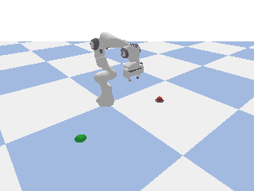

# Robotics simulator (PyBullet)

This is the real robot simulator for MachineProof. It replaces the mock robot adapter
(`ROBOT_ADAPTER=external`). A Franka Panda arm picks a 4 cm cube up at
`start_position`, carries it, and places it at `target_position`. The simulator then
measures where the cube actually came to rest and writes an **unsigned** proof JSON
in the MachineProof schema. Signing and submission go through the repo's existing
`npm run robot:submit`. The simulator adds no second API and no second crypto format.



```
task (from backend) → reset → approach → grasp → lift → transport → place → release
→ wait until the object is at rest → measure final position → proof JSON → robot:submit
```

The grasp is a real friction grasp under gravity and contact physics. The cube is never
teleported or attached to the gripper. A dropped cube really ends up away from the
target. The backend then measures the miss and refunds the escrow.

## Prerequisites

- Python 3.11 (`brew install python@3.11`). [uv](https://github.com/astral-sh/uv) is optional; it makes setup faster.
- The MachineProof repo set up (`npm ci` at the repo root), for submission.

## Install

```bash
cd robotics
./setup.sh          # creates robotics/.venv and installs PyBullet + deps
```

PyPI has no PyBullet wheel for macOS arm64, and the plain source build fails with
current macOS SDKs (a zlib `fdopen` macro clash). On Apple Silicon, `setup.sh`
therefore builds a patched wheel once, which takes a few minutes and goes into
`robotics/vendor/` (git-ignored). On Linux it is a normal `pip install`.

## Run against MachineProof (one command per task)

```bash
# repo root: chain, contracts, backend waiting for external robot proofs
npx hardhat node                                  # terminal 1
npm run deploy && ROBOT_ADAPTER=external npm run dev   # terminal 2

# create + fund a task (defaults: (0,0,0) → (1,0,0), tolerance 0.05 m)
curl -s -X POST localhost:3000/tasks -H 'content-type: application/json' -d '{"task_id":"task_001"}'
curl -s -X POST localhost:3000/tasks/task_001/fund

# simulate it and submit the proof
cd robotics && .venv/bin/python backend_bridge.py task_001
```

`backend_bridge.py <task_id>` does the following:

1. Reads the task with `GET /tasks/<task_id>`. This is where `robot_id`,
   `start_position`, `target_position` and `tolerance` come from.
2. Starts the task (`POST /tasks/<id>/start`) if it is `FUNDED`.
3. Runs the simulation with exactly those values and writes
   `robotics/results/<task_id>.json`.
4. Calls `npm run robot:submit -- robotics/results/<task_id>.json`, which does
   RFC 8785 → keccak256 → EIP-191 signing with `ROBOT_PRIVATE_KEY` and then
   `POST /tasks/<id>/proof`.

Options: `--api <url>` (default `http://127.0.0.1:3000`), `--record results/<id>.gif`
(save an animation), `--fault drop_in_transit|no_grasp` (a failure demo that ends in a
refund), and `--no-submit` (write the proof only).

To submit an existing proof file by hand: `npm run robot:submit -- robotics/results/task_001.json` (from the repo root).

## Run standalone / reset / re-run

```bash
.venv/bin/python run_simulation.py                                   # default task → robotics/output.json
.venv/bin/python run_simulation.py --task-id task_001 --start 0,0,0 --target 1,0,0
.venv/bin/python run_simulation.py --gui                             # watch it in a 3D window
.venv/bin/python run_simulation.py --fault drop_in_transit           # success=false
```

Every run builds a fresh physics world, so running the command again is the reset and
re-run. Other flags: `--robot-id`, `--tolerance`, `--output`, `--record x.gif`, and
`--timestamp` (fixed timestamp, for byte-identical output). `run_server.py` exposes the
same thing over HTTP (`POST /run-task`, `GET /task/:id/result`), for use without the
backend.

## Proof output

The core fields are exactly the MachineProof schema (`src/proof/schema.ts`):

```json
{
  "task_id": "task_001",
  "robot_id": "robot_001",
  "timestamp": "2026-10-07T12:00:00Z",
  "start_position": { "x": 0.0, "y": 0.0, "z": 0.0 },
  "target_position": { "x": 1.0, "y": 0.0, "z": 0.0 },
  "final_object_position": { "x": 0.9988, "y": 0.0007, "z": 0.0 },
  "success": true,
  "distance_to_target_m": 0.0014,
  "tolerance_m": 0.05,
  "checks": { "object_grasped": true, "object_lifted": true, "object_released": true, "object_at_rest": true, "within_tolerance": true },
  "measured_start_position": { "...": "..." },
  "robot_start_pose": { "base_position": { "...": "..." }, "base_yaw_rad": 1.5708, "joint_positions": ["..."] },
  "simulator": { "engine": "pybullet", "engine_version": "3.2.7", "physics_rate_hz": 240, "robot_model": "franka_panda" },
  "metrics": { "...": "..." },
  "trajectory": [ { "step": 48, "phase": "approach", "robot_position": ["..."], "object_position": ["..."] }, { "step": 1484, "event": "object_grasped" } ],
  "replay_hash": "…"
}
```

Full files: [`examples/proof_success.json`](examples/proof_success.json) and
[`examples/proof_failure.json`](examples/proof_failure.json).

- **Units and frame.** Coordinates are in meters, in the task frame. An object
  position is the center of the object's base, so an object on the floor has `z = 0`,
  like the backend tasks.
- **Start and target.** `start_position` and `target_position` are copied from the
  task, as the backend's `task_geometry` check requires. The measured start is in
  `measured_start_position`.
- **Timestamp.** `timestamp` is the current UTC time when the simulation runs. The
  run always happens after the bridge has read the task, so the timestamp is never
  earlier than the task's creation.
- **Rounding and success.** All numbers are rounded to 4 decimals (0.1 mm).
  `success` is `distance(final, target) <= tolerance`, computed on those same rounded
  numbers. The backend recomputes this independently.
- **Extra fields.** These are allowed by the schema and covered by the proof hash.
  `replay_hash` is the SHA-256 of the proof without `timestamp`. The simulation is
  deterministic, so re-running the same task reproduces it
  (`verify_proof.py <file> --replay`).

## Robot placement

The arm reaches 0.30–0.75 m from its base. If a task's points fit around the
task-frame origin, the base stays at the origin. Otherwise it is placed automatically
on the perpendicular bisector of A–B, facing the midpoint, which is like positioning
the robot cell for the job. This is how the default task (0,0,0) → (1,0,0) runs. The
chosen base pose is recorded in `robot_start_pose`. Points more than 1.5 m apart are
rejected before the task is started, and the task stays `FUNDED`.

## Tests

```bash
.venv/bin/python -m pytest -q        # 31 tests: success, schema, determinism, tampering, faults, placement, HTTP API
.venv/bin/python tools/sweep.py 300  # reliability sweep over random A/B pairs
```

A sweep of 300 random A/B pairs across the workspace gave 300/300 successful.
Placement error was median 1.5 mm, p95 4.1 mm, max 9.5 mm.

## Known limitations

- **Unsigned output.** The simulator writes an unsigned proof; trust in it comes from
  the robot key used by `robot:submit`. As the repo's trust model says, simulation is
  not trustless physical verification.
- **Determinism scope.** Results are bit-identical on the same OS, CPU architecture and
  PyBullet version. Other platforms can differ in the last digits; the 0.1 mm
  rounding absorbs most of this.
- **Scope.** One object (a 4 cm cube) and one arm. Points must be on the floor
  (`z` 0–0.3 m; the cube is always set down on the floor). There is no obstacle
  avoidance and no vision.
- **CRE mode.** Only the direct settlement path was run end to end with
  simulator proofs. The CRE path (`npm run demo:cre`) consumes the same signed
  submission, but it needs the `cre` CLI and a login, which were not available here.
